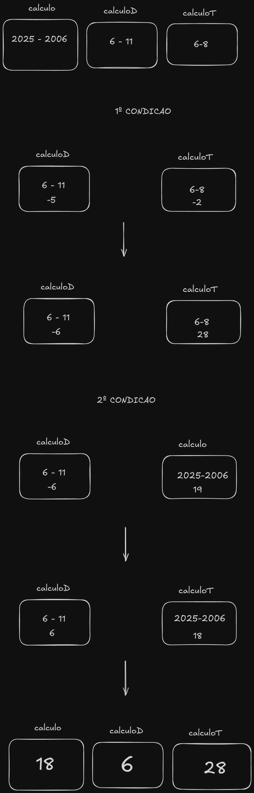
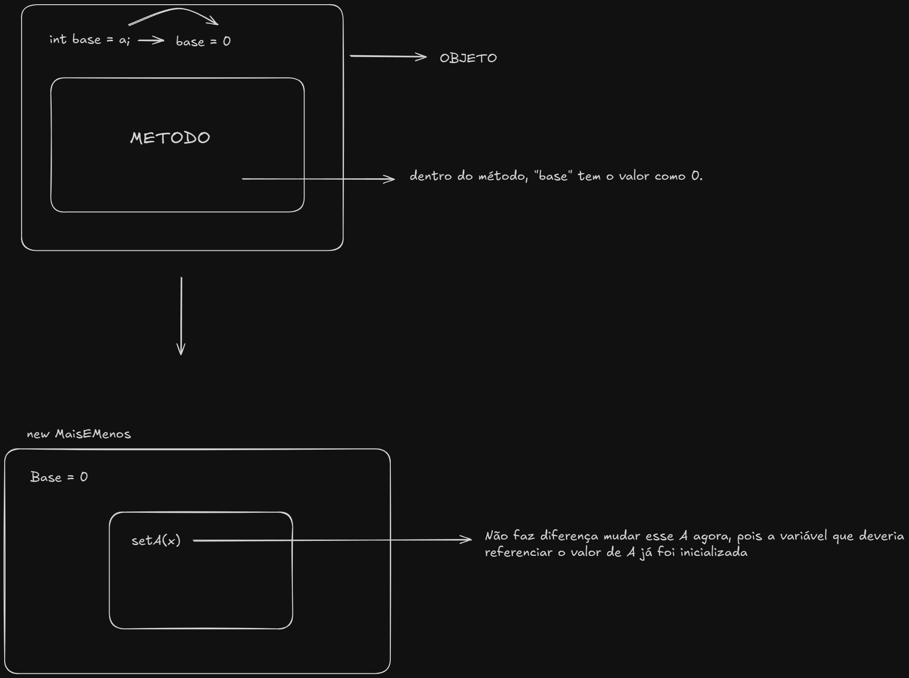

# Explicação Exercicios

## Base: 
* Nesse pacote há um compilado de exercicios resolvidos. Tenho ciência que os códigos em sua grande maioria (senão todos)
poderiam estar melhores escritos, seja por uma lógica diferente ou linhas desnecessárias. Dito isso, vou analisar os 
principais exercicios que tive dificuldade ou curiosidade em algo.
---
## Important
* Antes de citar as classes, é necessário pontuar o cerne. Criei três pacotes: um responsável por guardar variáveis e 
métodos que eu teria certeza o qual seriam repetidos continuamente; um para aplicar o algoritmo responsável do problema
em si; e o último contendo a classe **main** para de fato reproduzir tudo. Também sei que algumas heranças podem ser
questionáveis, mas deixei de pensar nisso (erroneamente) para esses exercicios em questão.
* As superclasses que majoritariamente vão aparecer por aqui são: Base e BaseDouble. A implementação **Calculo** e a 
superclasse **Calcular** também estarão presentes por questões óbvias. 
Aqui talvez haja a primeira parte confusa disso tudo.
* O grau de "importância" entre as classes é a seguinte: **INTERFACE** Calculo > **CLASSE** Calcular > **classe** Base &
BaseDouble e demais. 
* A interface possui o método calcular, que será usado literalmente em todos os exercicios. 
---
### Classe AnoNascimento
* Aqui há somente uma lógica interessante e que de primeira eu não havia raciocinado, mas gostaria de entender de fato.
Primeiro, há a criação de algumas variáveis. **ano, mes e dia** recebem, respectivamente, a b e c; além de outras três
que parecem ser inuteis, mas pra ideia atual faz sentido. Em **xBase**, há a data que vai ser usada como referencia para
o calculo seguinte. 

* No primeiro if, se averigua a possibilidade da variável **calculoTres** ser negativa, e se for, ocorre um decréscimo 
na variável **calculoDois** e um acréscimo de +30 na variável **calculoTres**. Dessa forma, diminui-se um mês e adiciona
os dias referentes àquele mês em questão. A lógica é exatamente a mesma no segundo if.
* Isso funciona porque, caso o resultado for negativo, isso significa que a pessoa não completou 19 anos (nesse caso).
Portanto, a contagem do ano ainda está em 18 e os meses estão contando.
* Vale pontuar algo que eu não havia percebido: o decréscimo, como visto no calculoD e calculoT, "acrescenta" pelo fato
do numero ser negativo: -5 - 1 > -6. Eu havia perdido isso inicialmente.

### Classe MaisEMenos
* O que vou falar aqui não é necessariamente sobre a classe, mas sobre algo que eu gostaria de ter falado antes e
percebi uma oportunidade agora.
* Declarar a variável fora do método (visivel como comentado) não funciona da maneira correta pois o valor que deveria
ser recebido, no caso, o que for posto no setA, sequer será considerado. Da maneira anterior, com a variavel declarada
fora do metodo, ao se criar um objeto do tipo MaisEMenos, ou seja, um "MaisEMenos maisEMenos = new MaisEMenos()", todas
as possíveis declarações de antemão já serão inicializadas com a criação desse objeto, então mesmo que se altere com um
setter, não irá funcionar; isso por causa da forma que está sendo feito a declaração. **Base** está recebendo o valor de
a, e a única coisa a qual posso alterar é a, mas percebe-se o fato de que base ja fora inicializada (como 0, visto que a
ainda não tem nenhum valor naquele ponto), então não nenhuma maneira mais de alterar o valor dessa variável, apenas o de
a. Por isso, ou se cria todo o processo dentro do metodo, ou não se usa a variavel base. Creio que essa última parte
pode ter a ver com minha ineficiência ao criar um algoritmo (por enquanto).
