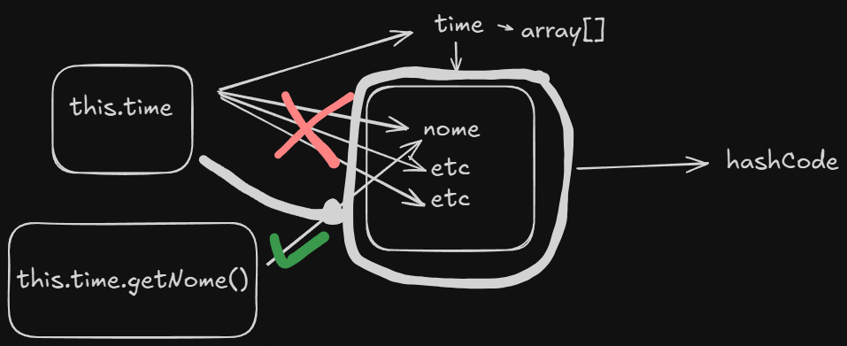
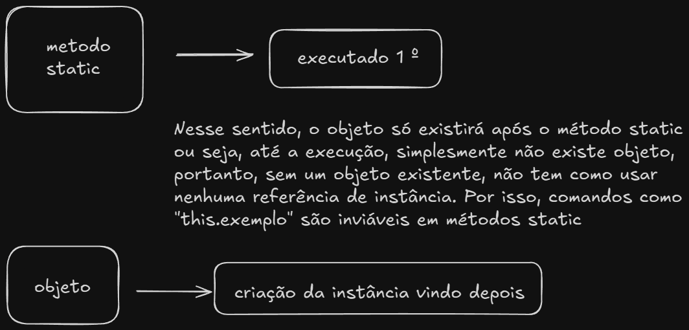

# Explicação - Exercício
---
## Base:
* Após boas aulas, decidi usar tudo que eu havia aprendido e não tinha "anotado" até o momento. 
* Pensei em um sisteminha que cadastrasse jogadores, estes que deveriam ter um time. Em suma, utilizei enumeração,
associação, modificadores como static, final.
---
## Classe Time
* Aqui há a maior presença do conceito de associação. Criei um array do tipo Jogador[] para a variável jogador. Ou seja,
aqui temos a presença de um M - m. Ademais, não há muito para se apresentar; Talvez o fato que eu percebi a inutilização
de certos getters e setters; me questiono o motivo deles não estarem sendo usados (sei que é porque não estou chamando).
---
## Classe Jogador
* Tirando a associação, há duas novidades nessa classe: chamada de construtores e toString.
### Variáveis
* Criei duas variáveis para jogador, que **é** uma pessoa, sendo elas uma do tipo Time e uma do tipo Chave; associação e
enumeração, respectivamente.
### Super() e this()
* No construtor, utilizando o **super**, estou chamando os atributos do construtor da classe mãe, que seria **Pessoa**.
É importante ressaltar sua importância em ser obrigatoriamente a **primeira** instrução em um construtor, caso usada. Isso
se dá necessário pela forma de inicialização do Java, o qual em casos de herança, dá prioridade à criação (no espaço em
memória ao ser executado) do que há dentro da classe Pai, e após, o que for possível utilizar com a classe filha. O comando
*super()* é usado para reutilizar um construtor presente na classe Pai, e dessa forma, não ser necessário reescrever 
todo aquele seguimento de "this.nome = nome;" por exemplo. Mesma coisa para o *this()*, mas se é usado especificamente
nos construtores da própria classe.
### toString
* É um dos métodos originais do Java. Interessante perceber que o "erro" que costuma acontecer ao referenciar o lugar 
do array, e não o que há em si, é na verdade um toString. 
* Esse método deve ser sobrescrito com as informações desejadas para retornar algo, é mais apropriado que o SOUT, eu acho.
Além disso, o @Override é uma forma de ter certeza que o método original está sendo sobrescrito, visto que o java pode
acabar entendendo que estou criando outro método (Por exemplo, toStringg seria algo totalmente diferente). Utilizei o \n
para dar um espaço na hora de retornar as informações. 
* Acho importante dizer um ponto no this.time.getNome(): digitar somente this.time retorna a referência inteira do
objeto Time, que está sendo associado. Agora, ao dizer time.getNome(), há o retorno da String nome, por isso, 
na primeira forma, costuma-se ter o *toString*, que mostra o hashCode, um valor int que serve para representar o objeto,
numericamente falando.

---
## Enumeração Chave
* Enum é uma forma especial de classe, o qual possui instâncias de si própria, estas que são constantes, ou seja, uma
vez seus valores definidos, não há como mudar.
* A classe enum é final, portanto, não pode ter subclasses (sem herança); por isso, as constantes, instâncias da classe,
não podem ser alteradas.

## Modificadores de Acesso
### Final
* O modificador *final* torna impossível qualquer alteração ao que quer que tenha sido associado. 
### Static
* *Static* altera a variável para fazer parte da classe em si, e não do objeto; ou seja, tudo que vier oriundo
de um objeto da classe, terá a variável static. Para acessar um atributo, ao invés de utilizar o **this**, que 
referencia a instância, deve-se usar a própria classe (Chave.NUMERO_QUARTO, algo nesse estilo); por causa disso, não
é possível usar getter e setter, pois estas fazem proveito de variáveis de referências, e não da classe em si.
* No caso de métodos, a ideia é a mesma. Entretanto, vale adicionar um adendo: ao criar um método static, o que tiver 
referenciando uma instância (this.exemplo), no entendimento do Java, têm a possibilidade de não existir. 

* Em suma, como statics são inicializados primeiro, eles podem, teoricamente, serem usados sempre, por isso, podem
ser acessados por métodos não statics; ao contrário, atributos não statics correm o risco de não existir em um contexto
static. 
* Vale lembrar, eles podem ter seu valor alterado caso o acesso for diretamente pela classe. Digamos que eu tenha criado
um atributo static int = 10. Se eu acessar NomeDaClasse.atributo = 1, o valor será alterado, visto que estou modificando
-o a base da classe.
## Values e ValuesOf()
* values() itera todos os valores possíveis da constante, retornando todos os valores desta em um array na ordem que foi
declarada o enum. Nesse caso, ele irá iterar de QUARTO_1 até QUARTO_10.
* valueOf() é usado em casos de String e, caso o nome inserido for exatamente igual, retornará o nome da constante 
respectiva. No caso de números, usar == é praticamente a mesma coisa, inclusive servindo como analogia.
