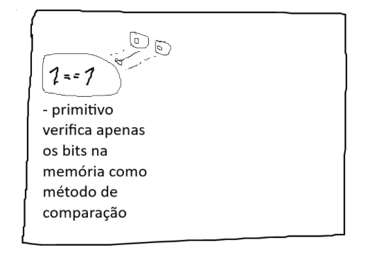

# Explicação Exercício 
## Base:
* Vi no tiktok e achei interessante fazer nesse domingo só pra não passar despercebido.
O "desafio" era pôr um número obrigatoriamente inteiro e identificar se é impar ou par,
senão inteiro, então não estava no caminho certo.
---
### Input.hasNextInt + Scanner: Lógica
* Mesmo tendo entendido e já sabendo o que cada um faz, achei interessante ao menos explicar aqui para fixar o que tenho
conhecimento.

1. O **Scanner** naturalmente lê o que foi digitado no teclado e deixa essa informação em um buffer, o qual mantém
gravado os dados em uma memória temporária. Dessa forma, o conteúdo não é lido imediatamente pelo programa, e ao passar
para o método de (hasNextInt), verifica-se o Token (Analog is my passion: uma letra em uma frase de um livro), e caso
seja ele inteiro, prossegue o programa, senão, o system out na linha 20.
----
### Operadores (=) (==)
* Ainda me confundo sobre eles, portanto acho interessante tentar explicar tanto para mim como para o exercício em si.
----
1. (**=**) atribui o valor da *direita* para a variável à *esquerda*, ou seja, se copia o valor para a outra.

------
2. (**==**) Fundamentalmente compara de fato os valores especificos na memória. Em casos de objeto, a comparação é feita
no endereço de memória
* (Ainda não entendi perfeitamente a forma que a comparação é feita na memoria)