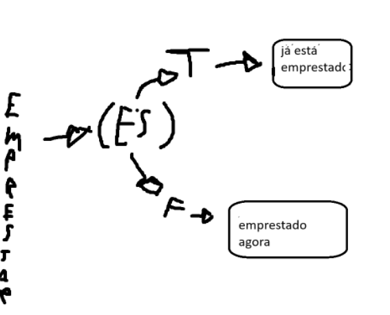

# Explicação Exercicio
## Base:
- **A teoria é fazer com que se possa:** 
1. Identificar as informações de um livro.
2. Ser capaz de devolver ou pegar emprestado o livro.

## Metodos: 
- **Nenhum getter ou setter utilizado; trocado pelo uso do construtor. Essa escolha pareceu ser válida, visto que na
situação é obrigatório haver informações, portanto nada mais justo do que esses argumentos serem necessários desde
o começo.**
### Emprestar & Devolver: Lógica
- **Desde o construtor, o atributo "estaEmprestado" é nativamente falso; essa escolha é baseada no contexto de que o
livro estaria a disposição de qualquer um, como em uma biblioteca de fato. Emprestar e Devolver possuem a mesma lógica
e no máximo estão diferenciadas pela questão da controversia lógica.**
1. O primeiro if do método **emprestar** (estaEmprestado) está averiguando se o livro foi ou não emprestado. O atributo
(estaEmpresado), escrito dessa forma, é nativamente **= TRUE**, portanto ao receber, por exemplo, um (estaEmprestado)
= false, ele irá alterar para = true, como visto na linha 21.

2. No método devolver, o processo é, como dito antes, reverso. A linha 28 identifica se o (estaEmprestado) é diferente 
de true (**!estaEmprestado**),ou seja, se ele é falso. Caso não for falso, ele irá alterar o estado do atributo para
false. 
* O seguimento de ambas faz sentido pela situação de que, ao chamar x ou y, é pressuposto que a intenção seja realizar
aquilo que o método foi feito para fazer. Ou seja, você não iria chamar o método emprestar sem a intenção de pegar o 
livro.

## LivroTest
* Criação normal do objeto de referência até a execução do método **exibirInfo()**. Esse método posto inicialmente tem a
função de exibir as informações do livro; categoricamente, o construtor ser obrigatório sugere que sempre haverá uma 
informação base, e como o (estaEmprestado) foi colocado para ser = FALSE na criação dos atributos, isso também implica
que naturalmente qualquer livro estará disponivel. A partir da linha 11/14, chamar o método vai possibilitar a execução 
deles de acordo com a situação atual do objeto, como anteriormente explciado. 
* As linhas 17 e 18 seriam usadas para testar a funcionalidade dos outros casos de conflito lógico.