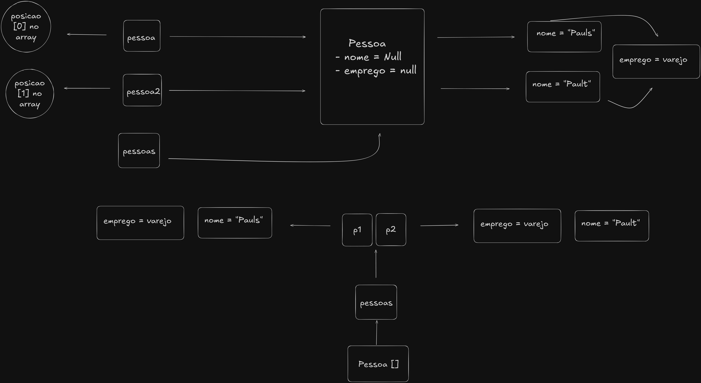

# Explicação Teórica 
## Base
* Não há muito o que falar, é somente o algoritmo main que vai executar o programa.

* **Adendo:** Como visto no README das classes, aqui se tem muito a presença de algoritmo repetido, portanto não vejo necessidade
de explicar cada uma, ponto por ponto, visto que só destrinchar uma delas já é o suficiente pra entender as outras.
---
### 
### Classe PessoaTest03
* Aqui há o suprassumo da complexidade que eu tive o prazer de fazer algo. Creio que primeiro é mais simples visualizar
o que está acontecendo por meio de um desenho; e aqui está: 

1. A classe **Pessoa** possui os atributos *nome* e *emprego*. Neles há a modificação pelas instâncias **pessoa**,
**pessoa2** e **emprego**, que acontecem de acordo com a imagem.
2. Ao criar **pessoas**, ela irá referenciar o array **Pessoa[]**, que por sua vez, faz referência às instâncias da 
classe **Pessoa**, onde *pessoa* == [0] e *pessoa2* == [1], no espaço em memória do array.
3. No campo dos setters, pelo que entendi, há a associação entre as instâncias. Em ambas instâncias, informa-se o 
programa que o **Emprego** presente na classe **Pessoa** de ambas será = a **emprego**. Mesma coisa com **emprego**,
onde setto que a referência para o atributo array presente em sua classe será **pessoas**.
----
### Erros:
* É perceptível que há um problema no **imprime** da linha 18, o qual retorna somente **pessoa**, e falta retornar
**pessoa1**; Consegui entender que isso é oriundo da falta de uma iteração, entretanto, não sei como resolver
no momento sem fazer muitas alterações no código como um todo.
* Alterar a ordem do algoritmo eventualmente pode causar um erro. Chuto que esteja relacionado ao fato de que cada 
uma depende da outra para rodar, apesar que algumas podem funcionar sem. 